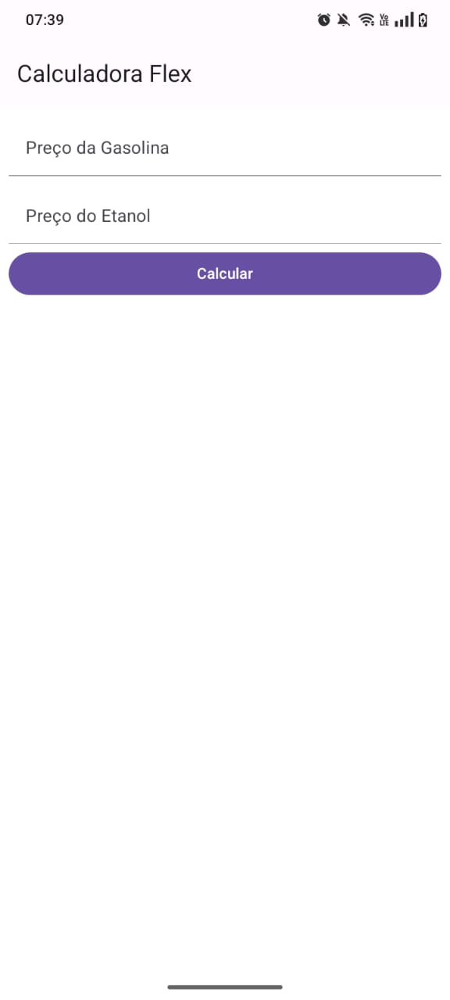

# Calculadora Flex (realizado na faculdade PUC-Minas)
## Projeto de calculadora para verificar qual tipo de combustível usar.
:trophy: O aplicativo calcula com base no preço da Gasolina e Etanol fornecidos pelo usuário qual deles
haverá mais economia ao abastecer.

## Tecnologias utilizadas
- React Native
- React Native Paper
- Expo/ Expo Go
- JavaScript

# Prints da aplicação

Página Inicial:

Alerta de campos não preenchidos ou com valores zerados:

Resposta a favor do Etanol:

Resposta a favor da Gasolina:

Status do Projeto: Concluido :heavy_check_mark:

